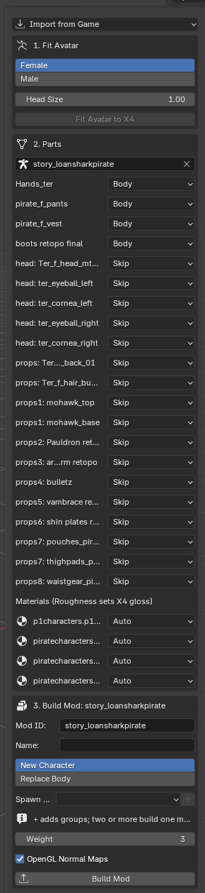
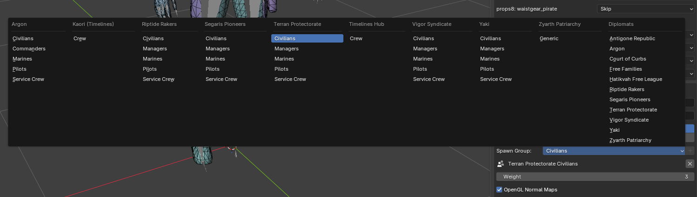
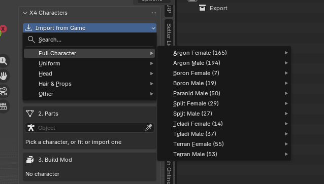

# X4 XAC Tools

A Blender add-on for putting your own characters into X4: Foundations or editing the ones
the game already has. It reads character models (`.xac`) straight from your X4 install and
writes a finished mod, so you never extract archives, pack files or write XML yourself.

Works with X4 9.00 and Blender 5.1 (4.2 LTS works too).

## Install

1. Download `x4_xac-<version>.zip` from
   [Releases](https://github.com/ToffelsKater/x4-xac-tools/releases).
2. In Blender, go to `Edit > Preferences > Get Extensions`, open the `⌄` menu and choose
   `Install from Disk...`, then pick the zip.
3. The add-on finds X4 through Steam. If it can't, set the game folder in the add-on
   preferences.

Everything else happens in the X4 tab of the sidebar. Press `N` in the 3D viewport to open it.



## Put your own avatar in the game

1. Import your avatar into Blender (FBX, VRM, .blend and so on).
2. Select its armature. Under Fit Avatar, pick Female or Male, set the Head Size and click
   Fit Avatar to X4. Unity/VRChat, VRM, Mixamo and Biped rigs are recognised. The avatar is
   posed onto X4's skeleton, and its weights and shape keys come along.
3. Check the Parts list. Each mesh is marked Head, Body or Skip, guessed from its weights.
   For each material you can pick opaque or cutout (for hair) and set the roughness.
4. Check the Face box. It links the 16 face animations X4 plays (blinking, expressions and
   lip sync) to your shape keys. Fit fills it in when the keys have VRChat, VRM, MMD or plain
   English names. Press ⟳ to guess again.
5. Pick a mode under Build Mod:
   - New Character adds your character as a new NPC. Choose a Spawn Group (a faction and a
     role) and press + to add it. With two or more groups you get one mod per group, and
     each one can be switched on or off in the game. Weight sets how often your character
     spawns, where every vanilla character counts as 1.
   - Replace Body swaps one game uniform for your body everywhere the game uses it. The
     game's heads stay. The uniform you replace must use the skeleton you fitted to.

   
6. Click Build Mod. The mod is written to `X4 Foundations/extensions/<Mod ID>`. Enable it in
   the game's extension list. To remove it, delete that folder.

## Edit a character from the game

1. Click Import from Game. Search for a model, or browse by type and then by race:
   Full Character gives you a uniform with its head and hair, the way the game puts them
   together. Head and hair are set to Skip, so only the uniform is built. Uniform, Head,
   Hair & Props and Other give you single models. Models from your installed mods show up
   too, and textures come along.

   
2. Edit the meshes: sculpt, add parts, weight paint. Keep the game's materials or use your
   own.
3. Build the mod in Replace Body mode and leave Body empty. Your version replaces the file
   you imported.

## Good to know

- One scene can hold several characters. The Character field at the top of Parts chooses
  the one you're working on, and each character keeps its own mod settings and Mod ID.
- Normal maps are expected in OpenGL format (Blender, Unity). Untick OpenGL Normal Maps if
  yours are DirectX.
- The skeleton always comes from the game file, so moving bones in Blender changes nothing
  in game.
- Keep each material at 57 bones or fewer.
- A custom head doesn't get the game's random face variations, and its eyes move with the
  head instead of looking at things. Face animation on custom heads hasn't been checked in
  game yet.

## For developers

`File > Import > X4 Character (.xac)` and `File > Export > X4 Character (.xac)` work on
single files. `tools/` holds command-line scripts for extracting game files, inspecting
models and testing the add-on, and `io_scene_x4_xac/xac.py` documents the file format.
To build the zip:

```powershell
blender --factory-startup --command extension build --source-dir io_scene_x4_xac --output-dir dist
```
